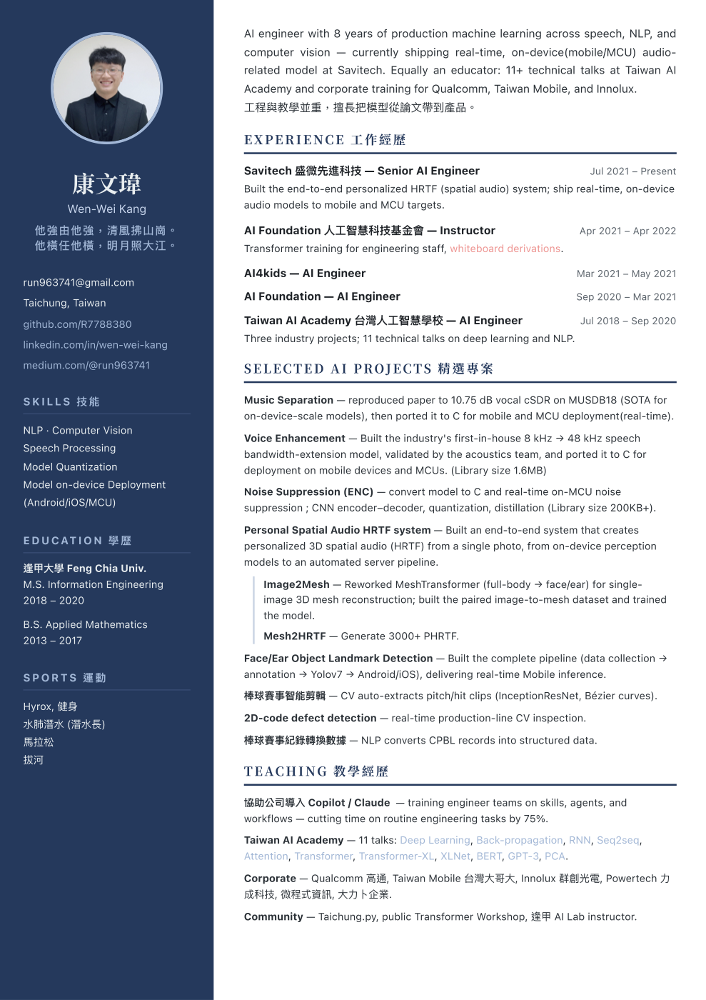

# 康文瑋 Wen-Wei Kang — Resume

Senior AI Engineer at Savitech · real-time, on-device audio ML (speech enhancement,
noise suppression, spatial audio / HRTF) · NLP & computer vision · educator (11+ technical talks).

**▶ [View the resume](https://r7788380.github.io/)** · **[Download PDF](Wen-Wei_Kang_Resume.pdf)**

## Links

- GitHub: https://github.com/R7788380
- LinkedIn: https://www.linkedin.com/in/wen-wei-kang-533119131/
- Medium: https://medium.com/@run963741
- Live demo — Bandwidth Extension results: https://r7788380.github.io/bwe-stream-sdk-results/
